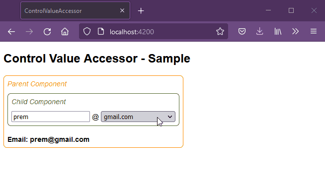

# Control Value Accessor - Overview
Two way(bi-directional) binding for custom components in Angular using [ControlValueAccessor](https://angular.io/api/forms/ControlValueAccessor).

## Steps to execute this code
### 1. Download code
```
git clone git@github.com:Prem119/angular-control-value-accessor.git
```

### 2. Install packages  
```
npm install
```

### 3. Launch sample application  
```
npm start
```

## Result

